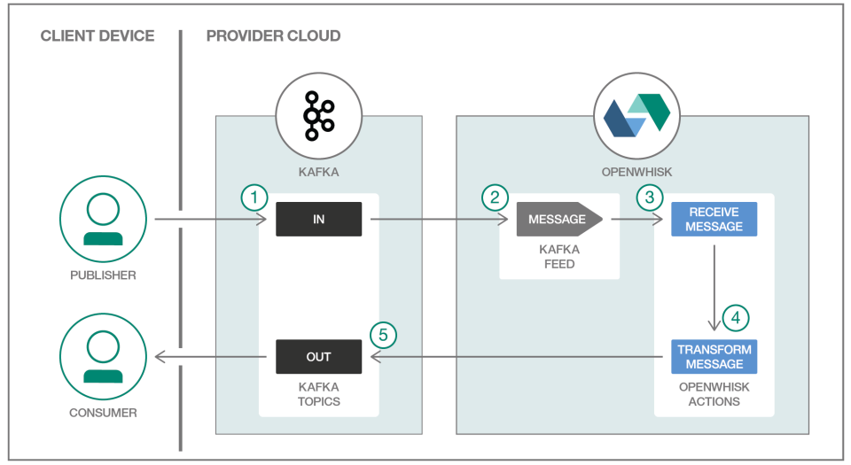

# Getting Started with OpenWhisk and Message Hub
This project provides sample code for creating your Message Hub (Kafka) data processing app with Apache OpenWhisk on IBM Bluemix. It should take no more than 10 minutes to get up and running.

This sample assumes you have a basic understanding of the OpenWhisk programming model, which is based on Triggers, Actions, and Rules. If not, you may want to [explore this demo first](https://github.com/IBM/openwhisk-action-trigger-rule).

Serverless platforms like Apache OpenWhisk provide a runtime that scales automatically in response to demand, resulting in a better match between the cost of cloud resources consumed and business value gained.

One of the key use cases for OpenWhisk is to execute logic in response to events, such as messages or new streams of data. Instead of pre-provisioning resources in anticipation of demand, these actions are started and destroyed only as needed in response to demand.

Once you complete this sample application, you can move on to more complex serverless application use cases, such as those named _OpenWhisk 201_ or tagged as [_openwhisk-use-cases_](https://github.com/search?q=topic%3Aopenwhisk-use-cases+org%3AIBM&type=Repositories).

## Overview of message flow

Flow of processing goes as follows:

1. An external process (simulated by the script [`kafka_publish.sh`](kafka_publish.sh)) puts a message into IBM Message Hub (Kafka) using the REST API into the topic _in-topic_.
2. An OpenWhisk feed associated with Message Hub that starts a trigger _kafka-trigger_. The trigger is linked by a rule _kafka-inbound-rule_, which invokes a _kafka-sequence_ sequence.
3. That sequence invokes two actions one after another. The first action called is _consume-kafka-action_. It fetches the message from Message Hub and validates that message.
4. The output of the first action is passed as input into the action _publish-kafka-action_. This action counts the number of "events" in the input message, generates a summary JSON document, and then publishes it into the Message Hub topic _out-topic_.
5. An external process (simulated by the [`kafka_consume.sh`](kafka_consume.sh)) then retrieves the message from Message Hub using the REST API and prints it on the screen. Please note that due to latency issues, you may need to run the message consumer again if it did not get the message the first time.

# Installation
Setting up this sample involves configuration of OpenWhisk and Message Hub on IBM Bluemix. [If you haven't already signed up for Bluemix and configured OpenWhisk, review those steps first](docs/OPENWHISK.md).

### Setting up Message Hub
First, let's set up Message Hub on Bluemix. We need it to broker messages between our simulated clients and actions on OpenWhisk.

1. Go to the Bluemix Catalog page and select [Message Hub service](https://console.ng.bluemix.net/catalog/services/message-hub).
2. Click "Create" in the right hand bottom corner. Lets assume you called your Message Hub broker "kafka-broker".
3. On a "Manage" tab of your Message Hub console create two topics: _in-topic_ and _out-topic_.

> If you want to change names of topics or other resources, please update [`env.sh`](env.sh) file to reflect your changes.

### Setting up OpenWhisk
The next step is to configure OpenWhisk to perform the message consumption, transformation, and publishing.

1. Copy [`template.local.env`](template.local.env) into `local.env` and update it with proper credentials (from the "Credentials" tab in the Message Hub UI).
3. Run the [`deploy.sh`](deploy.sh) script. This will package and deploy your JavaScript actions to OpenWhisk on Bluemix.

### Test the application
Now that your Message Hub and OpenWhisk are configured and cloud resources are deployed, it is time to test the application.

1. Send one or more test messages by running [`kafka_publish.sh`](kafka_publish.sh) script. This will kick off the chain of processing.
2. Get responses from the server by running [`kafka_consume.sh`](kafka_consume.sh) script. It will display results on your screen.

This example is intentionally kept simple, but you can extend it with many additional actions, triggers, rules and connect OpenWhisk to other resources to build more complex message and stream processing applications.

### Troubleshooting
The first place to check for errors is the OpenWhisk activation log. You can view it by tailing the log on the command line with `wsk activation poll` or you can view the [monitoring console on Bluemix](https://console.ng.bluemix.net/openwhisk/dashboard).

# Credits
This project was inspired by and reuses significant amount of code from [this article](https://medium.com/openwhisk/transit-flexible-pipeline-for-iot-data-with-bluemix-and-openwhisk-4824cf20f1e0#.talwj9dno).

# License
Licensed under [Apache 2.0 license](LICENSE.txt).
